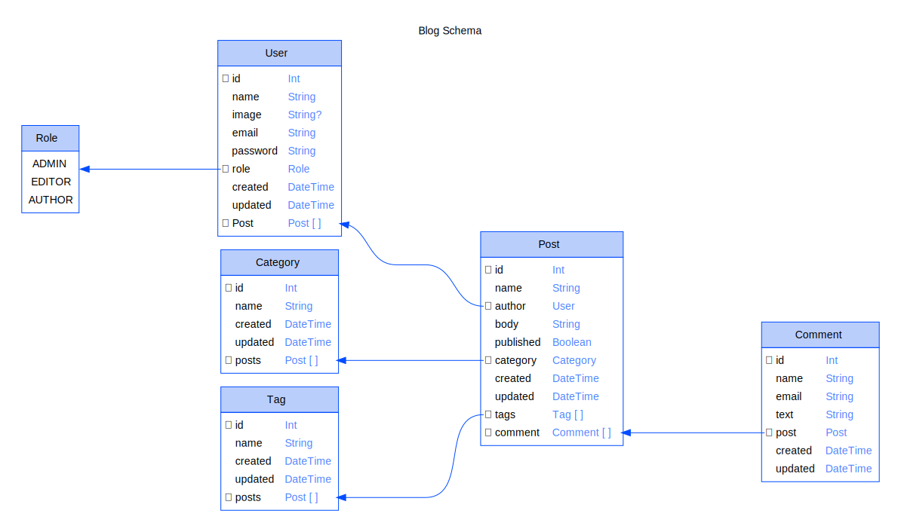

# Prisma Grapher

Prisma generator to create an ER Diagram every time you generate your prisma client.

Inspired by [prisma-erd-generator](https://github.com/keonik/prisma-erd-generator/blob/main/README.md)

## Install

```sh
yarn add -D prisma-grapher
```

or

```sh
npm install -D prisma-grapher
```

## Configure

Add to your schema.prisma

```prisma
generator erd {
  provider = "prisma-grapher"
}
```

## Generate

Run the generator

```sh
npx prisma generate
```

## Output



## Options

```prisma
generator erd {
  provider              = "prisma-grapher"
  output                = "./ERD.svg"
  disabled              = false
  title                 = "Blog Schema"
  lineColor             = "#004cff"
  headerBackgroundColor = "#bacefc"
  headerForegroundColor = "black"
  bodyBackgroundColor   = "white"
  bodyForegroundColor   = "black"
  typeForegroundColor   = "#4f83ff"
}
```
